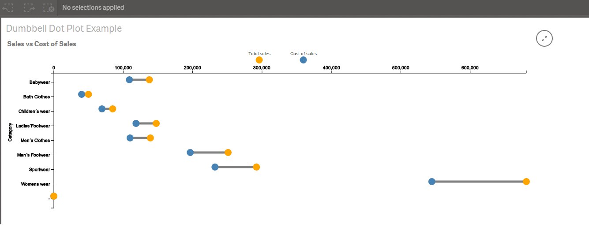

# Qlik Sense Extension - Dumbbell Dot Plot

This extension creates a dot plot which shows the difference of two measures for one dimension.

**Implementation**
The dumbbell dot plot takes one dimension and two measures:

Dimension: The dimension for the Y-axis

Measure 1: The measure for the first dot for the dimension

Measure 2: The measure for the second dot for the dimension

A bar will be automatically drawn from the first measure to the second measure for each dimension.  This makes it easy to compare the variations of the differences amongst the dimensions.

**Note:**  For best results, choose two measures that are similar in amount, i.e budget and spending

